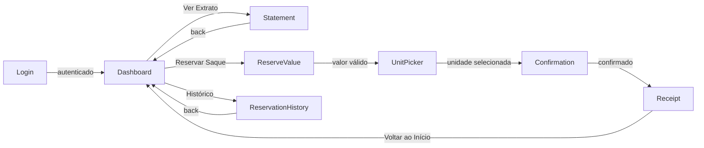
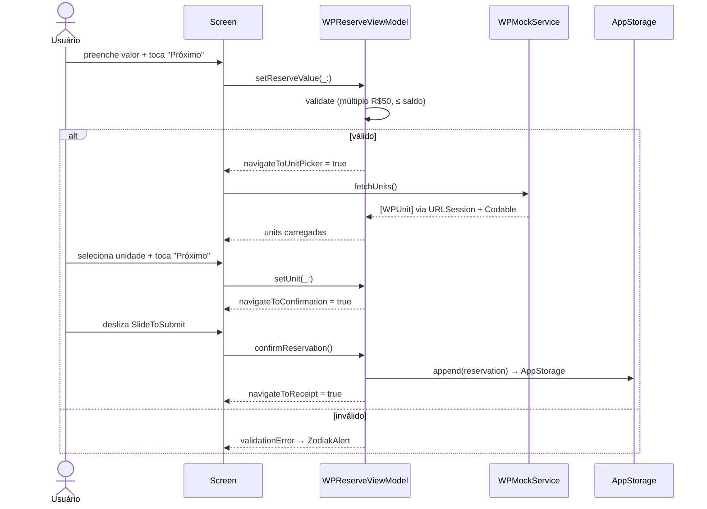

# Épico 29 — Provisionamento de Saque

> **Categoria**: Projeto Final iOS
> **Prioridade**: P1
> **Plataforma**: iOS (SwiftUI)
> **Status**: Backlog
> **Referência**: [finalBacklog.md — Projeto 1](../../raw_pdf/finalBacklog.md)

---

## Proposta

Reserva de valor para saque em uma unidade bancária específica. O usuário autentica-se, visualiza seu saldo disponível, informa o valor desejado, escolhe a unidade onde fará o saque e confirma a operação, recebendo um comprovante com número de protocolo.

---

## API e persistência

| Dado | Fonte | Persistência |
|---|---|---|
| Lista de unidades disponíveis | `units_mock.json` via URLSession + Codable | em memória (cache por sessão) |
| Extrato de transações | `transactions_mock.json` via URLSession | em memória |
| Estado de autenticação | `@AppStorage("wp.isAuthenticated")` | UserDefaults |
| Histórico de reservas | `@AppStorage("wp.reservations")` (JSON encoded) | UserDefaults |

---

## Diferencial

Fluxo bancário claro com confirmação step-by-step (`ZodiakStepIndicator`) e comprovante fake com UUID de protocolo e opção de compartilhamento (`ZodiakShare`).

---

## Telas (8)

| # | US | Tela | Prioridade |
|---|---|---|---|
| 1 | [US-29.01](us-01-login.md) | Login / Autenticação | P0 |
| 2 | [US-29.02](us-02-dashboard.md) | Saldo / Dashboard | P0 |
| 3 | [US-29.03](us-03-statement.md) | Extrato | P0 |
| 4 | [US-29.04](us-04-reserve-value.md) | Reserva de Valor (Step 1/3) | P0 |
| 5 | [US-29.05](us-05-unit-picker.md) | Escolha de Unidade (Step 2/3) | P0 |
| 6 | [US-29.06](us-06-confirmation.md) | Confirmação (Step 3/3) | P0 |
| 7 | [US-29.07](us-07-receipt.md) | Comprovante | P1 |
| 8 | [US-29.08](us-08-reservation-history.md) | Histórico de Reservas | P1 |

---

## Componentes DS de referência

`ZodiakLoginForm`, `ZodiakKeyFigures`, `ZodiakInfoRow`, `ZodiakArrowButton`, `ZodiakSkeletonLoader`, `ZodiakEmptyState`, `ZodiakNotice`, `ZodiakChipGroup`, `ZodiakShowMore`, `ZodiakLabelledNumericField`, `ZodiakSliderCounter`, `ZodiakStepIndicator`, `ZodiakRadioButton`, `ZodiakSearchField`, `ZodiakSlideToSubmit`, `ZodiakModal`, `ZodiakWarningButton`, `ZodiakShare`, `ZodiakStatusChip`, `ZodiakHorizontalCard`, `ZodiakAlert`

---

## Fluxo de navegação

---

## Fluxo de dados — sequência principal (reserva)

