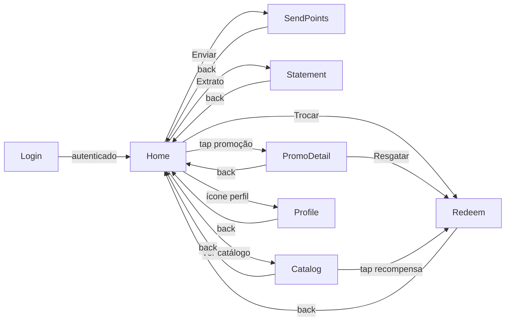
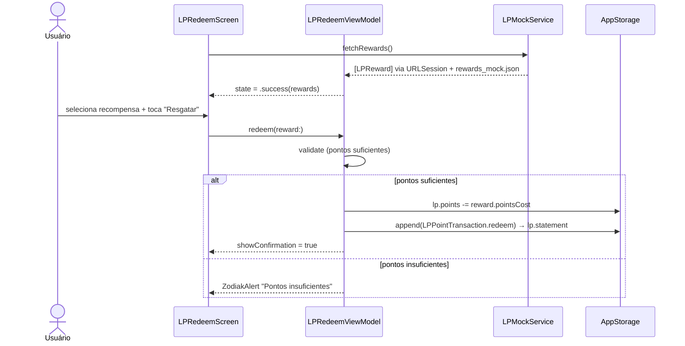

# Épico 30 — Programa Fidelidade

> **Categoria**: Projeto Final iOS
> **Prioridade**: P1
> **Plataforma**: iOS (SwiftUI)
> **Status**: Backlog
> **Referência**: [finalBacklog.md — Projeto 2](../../raw_pdf/finalBacklog.md)

---

## Proposta

Plataforma de troca e envio de pontos entre clientes. O usuário acumula pontos via promoções exibidas na home, pode trocá-los por produtos/serviços/desconto em fatura, enviar pontos para outros CPFs e consultar seu extrato de movimentações.

---

## API e persistência

| Dado | Fonte | Persistência |
|---|---|---|
| Promoções em destaque | `promotions_mock.json` via URLSession + Codable | em memória |
| Catálogo de recompensas | `rewards_mock.json` via URLSession + Codable | em memória |
| Saldo de pontos | `@AppStorage("lp.points")` | UserDefaults |
| Extrato de pontos | `@AppStorage("lp.statement")` (JSON encoded) | UserDefaults |
| Dados do perfil | `@AppStorage("lp.profile")` (JSON encoded) | UserDefaults |
| Estado de autenticação | `@AppStorage("lp.isAuthenticated")` | UserDefaults |

---

## Diferencial

Carrossel de promoções no home com scroll horizontal animado e simulação de troca de pontos por produtos, serviços ou desconto em fatura, incluindo cálculo de pontos restantes em tempo real.

---

## Telas (7)

| # | US | Tela | Prioridade |
|---|---|---|---|
| 1 | [US-30.01](us-01-login.md) | Login / Autenticação | P0 |
| 2 | [US-30.02](us-02-home.md) | Home — Pontos e Promoções | P0 |
| 3 | [US-30.03](us-03-redeem.md) | Troca de Pontos (+ Catálogo) | P0 |
| 4 | [US-30.04](us-04-send-points.md) | Envio de Pontos | P0 |
| 5 | [US-30.05](us-05-statement.md) | Extrato de Pontos | P0 |
| 6 | [US-30.06](us-06-profile.md) | Atualizar Dados | P1 |
| 7 | [US-30.07](us-07-promo-detail.md) | Detalhe de Promoção | P1 |
| ~~8~~ | ~~[US-30.08](us-08-catalog.md)~~ | ~~Catálogo Completo~~ | ~~Merged → US-30.03~~ |

---

## Componentes DS de referência

`ZodiakLoginForm`, `ZodiakKeyFigures`, `ZodiakQuickAccessBar`, `ZodiakSkeletonLoader`, `ZodiakEmptyState`, `ZodiakNotice`, `ZodiakTallCard`, `ZodiakCardGrid`, `ZodiakChipGroup`, `ZodiakMultiselect`, `ZodiakShowMore`, `ZodiakPhoneInput`, `ZodiakLabelledNumericField`, `ZodiakStepIndicator`, `ZodiakSlideToSubmit`, `ZodiakModal`, `ZodiakFormContainer`, `ZodiakLabelledField`, `ZodiakPasswordField`, `ZodiakHero`, `ZodiakInfoRow`, `ZodiakArrowButton`, `ZodiakAlert`

---

## Fluxo de navegação

---

## Fluxo de dados — sequência principal (troca de pontos)

