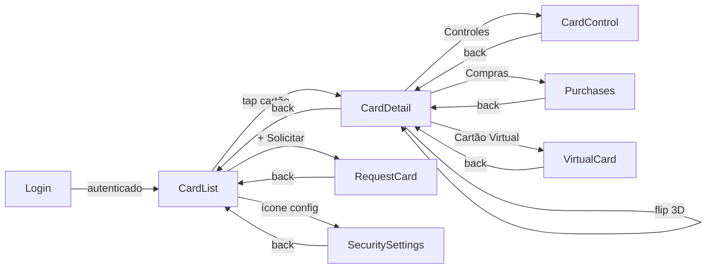
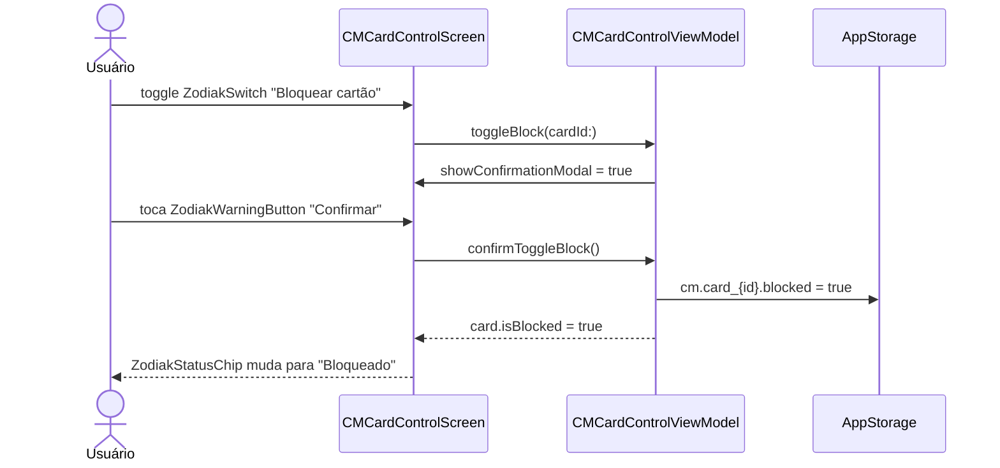

# Épico 31 — Gerenciador de Cartões

> **Categoria**: Projeto Final iOS
> **Prioridade**: P1
> **Plataforma**: iOS (SwiftUI)
> **Status**: Backlog
> **Referência**: [finalBacklog.md — Projeto 3](../../raw_pdf/finalBacklog.md)

---

## Proposta

Mini-app completo de gestão de cartões de crédito e débito. Exibe lista de cartões por bandeira com status, permite visualizar detalhes com animação de flip 3D (frente/verso), solicitar novo cartão via wizard, bloquear/desbloquear, gerenciar limite e visualizar compras por período. CVV dinâmico com Timer de 30 segundos.

> **Nota de nomenclatura**: A entrada principal é `CMRootScreen.swift` para evitar conflito de nome com a feature existente `14-CardManager/CardManagerScreen.swift`.

---

## API e persistência

| Dado | Fonte | Persistência |
|---|---|---|
| Lista de cartões | `cards_mock.json` via URLSession + Codable | em memória |
| Status de bloqueio | `@AppStorage("cm.card_{id}.blocked")` | UserDefaults |
| Limite ajustado | `@AppStorage("cm.card_{id}.limit")` | UserDefaults |
| Compras por cartão | `purchases_mock.json` via URLSession | em memória |
| Cartão virtual (CVV) | Timer de 30s + UUID mock | em memória |

---

## Diferencial

Animação de flip 3D usando `rotation3DEffect` — frente exibe número mascarado e nome, verso exibe CVV dinâmico com countdown circular. CVV é regenerado a cada 30 segundos via `Timer.publish`.

---

## Telas (8)

| # | US | Tela | Prioridade |
|---|---|---|---|
| 1 | [US-31.01](us-01-login.md) | Login | P0 |
| 2 | [US-31.02](us-02-card-list.md) | Lista de Cartões | P0 |
| 3 | [US-31.03](us-03-card-detail.md) | Detalhe do Cartão (Flip 3D) | P0 |
| 4 | [US-31.04](us-04-request-card.md) | Solicitar Novo Cartão | P0 |
| 5 | [US-31.05](us-05-card-control.md) | Controles do Cartão | P0 |
| 6 | [US-31.06](us-06-purchases.md) | Compras por Período | P1 |
| 7 | [US-31.07](us-07-virtual-card.md) | Cartão Virtual / CVV Dinâmico | P1 |
| 8 | [US-31.08](us-08-security-settings.md) | Configurações de Segurança | P1 |

---

## Componentes DS de referência

`ZodiakLoginForm`, `ZodiakLabelledField`, `ZodiakPasswordField`, `ZodiakButton`, `ZodiakAlert`, `ZodiakTallCard`, `ZodiakStatusChip`, `ZodiakSkeletonLoader`, `ZodiakEmptyState`, `ZodiakNotice`, `ZodiakInfoRow`, `ZodiakEyebrow`, `ZodiakStepIndicator`, `ZodiakInputWizard`, `ZodiakDropdown`, `ZodiakSlideToSubmit`, `ZodiakSwitch`, `ZodiakSliderCounter`, `ZodiakModal`, `ZodiakWarningButton`, `ZodiakTabs`, `ZodiakChipGroup`, `ZodiakShowMore`, `ZodiakProgressIndicator`, `ZodiakFormContainer`

---

## Fluxo de navegação

---

## Fluxo de dados — sequência principal (bloqueio de cartão)

