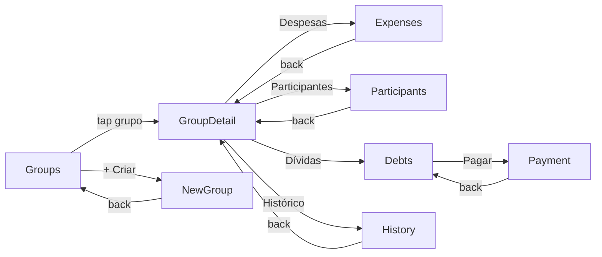
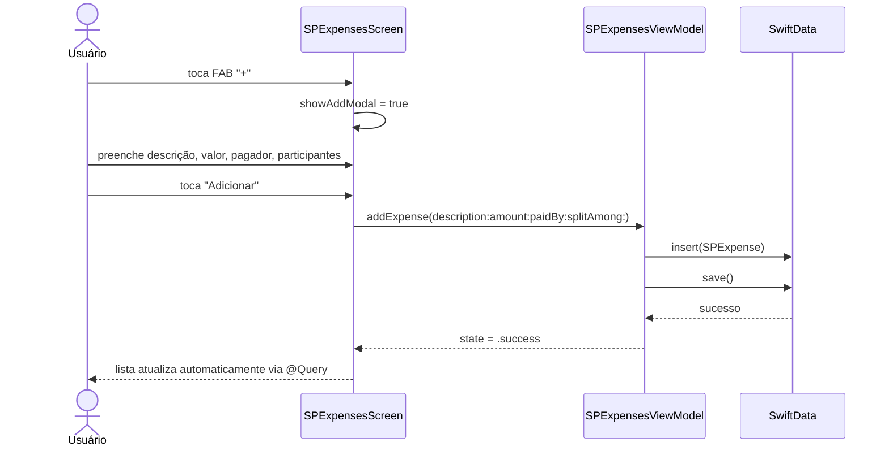

# Épico 32 — SplitPay

> **Categoria**: Projeto Final iOS
> **Prioridade**: P1
> **Plataforma**: iOS (SwiftUI)
> **Status**: Backlog
> **Referência**: [finalBacklog.md — Projeto 4](../../raw_pdf/finalBacklog.md)

---

## Proposta

App de divisão de despesas em grupos. O usuário cria grupos, adiciona participantes e registra despesas. Um algoritmo de balanceamento calcula as dívidas com o mínimo de transações necessárias. Persistência completa via SwiftData.

---

## API e persistência

| Dado | Fonte | Persistência |
|---|---|---|
| Grupos | SwiftData `SPGroup @Model` | SwiftData (local) |
| Despesas | SwiftData `SPExpense @Model` | SwiftData (local) |
| Participantes | SwiftData `SPParticipant @Model` | SwiftData (local) |
| Grupos de exemplo | `groups_mock.json` via URLSession (seed inicial) | SwiftData |

---

## Diferencial

Algoritmo de balanceamento com mínimo de transações: calcula os saldos líquidos de cada participante e usa estratégia greedy para minimizar o número de pagamentos necessários para zerar todas as dívidas.

---

## Telas (8)

| # | US | Tela | Prioridade |
|---|---|---|---|
| 1 | [US-32.01](us-01-groups.md) | Lista de Grupos | P0 |
| 2 | [US-32.02](us-02-expenses.md) | Despesas do Grupo | P0 |
| 3 | [US-32.03](us-03-participants.md) | Participantes | P0 |
| 4 | [US-32.04](us-04-debts.md) | Resumo de Dívidas | P0 |
| 5 | [US-32.05](us-05-payment.md) | Registrar Pagamento | P0 |
| 6 | [US-32.06](us-06-history.md) | Histórico de Transações | P1 |
| 7 | [US-32.07](us-07-new-group.md) | Criar Novo Grupo | P0 |
| 8 | [US-32.08](us-08-group-detail.md) | Resumo do Grupo | P1 |

---

## Componentes DS de referência

`ZodiakEmptyState`, `ZodiakButton`, `ZodiakModal`, `ZodiakLabelledField`, `ZodiakLabelledNumericField`, `ZodiakDropdown`, `ZodiakMultiselect`, `ZodiakAvatar`, `ZodiakStatusChip`, `ZodiakKeyFigures`, `ZodiakInfoRow`, `ZodiakSlideToSubmit`, `ZodiakChipGroup`, `ZodiakShowMore`, `ZodiakSkeletonLoader`, `ZodiakTabs`, `ZodiakNotice`, `ZodiakWarningButton`, `ZodiakDivider`, `ZodiakEyebrow`

---

## Modelos SwiftData

```swift
@Model class SPGroup { var id: UUID; var name: String; var emoji: String; var createdAt: Date; var participants: [SPParticipant]; var expenses: [SPExpense] }
@Model class SPParticipant { var id: UUID; var name: String; var color: String; var group: SPGroup? }
@Model class SPExpense { var id: UUID; var description: String; var amount: Double; var paidBy: SPParticipant; var splitAmong: [SPParticipant]; var date: Date; var group: SPGroup? }
```

---

## Fluxo de navegação



---

## Fluxo de dados — sequência principal (adicionar despesa)


