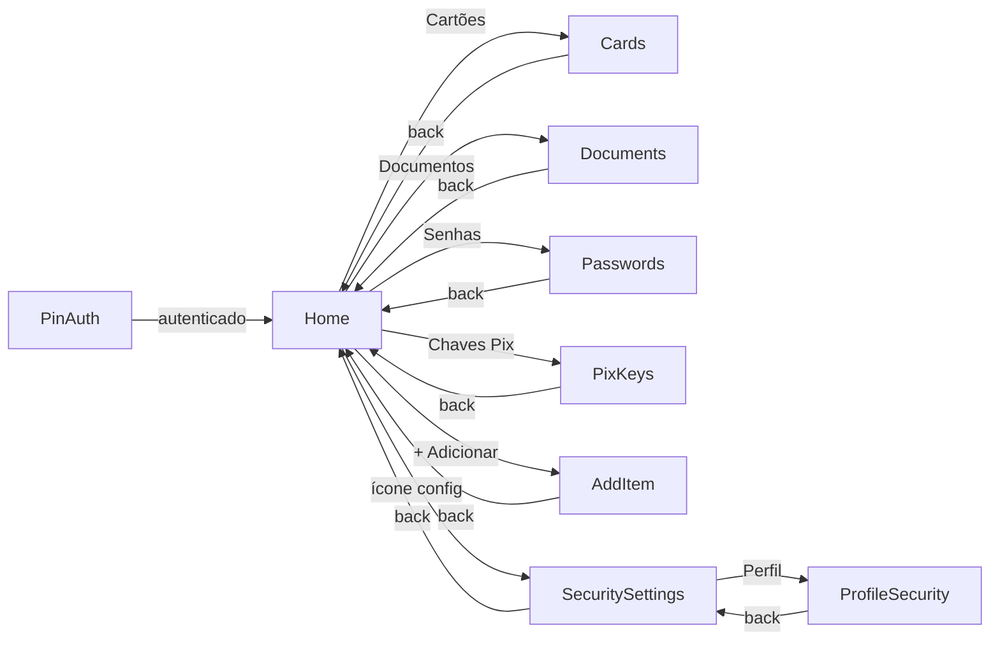
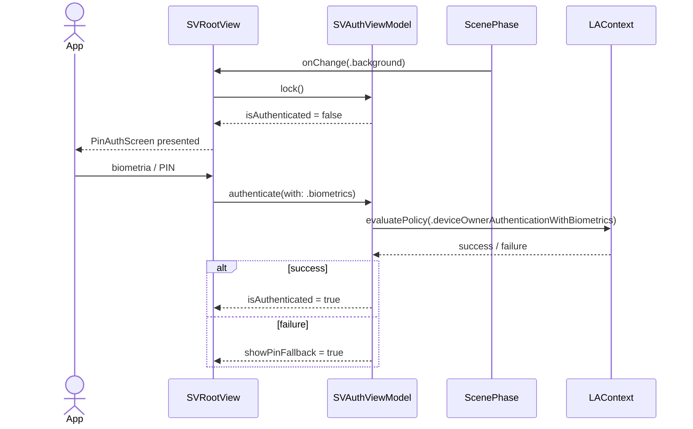

# Épico 33 — SafeVault

> **Categoria**: Projeto Final iOS
> **Prioridade**: P1
> **Plataforma**: iOS (SwiftUI)
> **Status**: Backlog
> **Referência**: [finalBacklog.md — Projeto 5](../../raw_pdf/finalBacklog.md)

---

## Proposta

Cofre digital seguro para armazenar cartões, documentos, senhas e chaves Pix. Protegido por PIN de 6 dígitos e biometria via `LocalAuthentication`. Auto-lock ativado quando o app vai para background via `ScenePhase`. Dados mascarados por padrão com reveal via long-press.

---

## API e persistência

| Dado | Fonte | Persistência |
|---|---|---|
| Itens do cofre | SwiftData `SVVaultItem @Model` | SwiftData (local) |
| PIN de acesso | `@AppStorage("sv.pin")` (hashed, mock) | UserDefaults |
| Configurações de segurança | `@AppStorage("sv.biometrics")`, `@AppStorage("sv.autolock_timeout")` | UserDefaults |

---

## Diferencial

Auto-lock via `onChange(of: scenePhase)` — ao ir para background, a sessão é bloqueada. Biometria via `LAContext` (Face ID / Touch ID) com fallback para PIN. Mascaramento de dados por padrão com reveal via long-press gesture.

---

## Telas (8)

| # | US | Tela | Prioridade |
|---|---|---|---|
| 1 | [US-33.01](us-01-pin-auth.md) | Autenticação PIN / Biometria | P0 |
| 2 | [US-33.02](us-02-cards.md) | Cartões Armazenados | P0 |
| 3 | [US-33.03](us-03-documents.md) | Documentos | P0 |
| 4 | [US-33.04](us-04-passwords.md) | Senhas | P0 |
| 5 | [US-33.05](us-05-pix-keys.md) | Chaves Pix | P0 |
| 6 | [US-33.06](us-06-profile-security.md) | Perfil e Segurança | P1 |
| 7 | [US-33.07](us-07-add-item.md) | Adicionar Item | P0 |
| 8 | [US-33.08](us-08-security-settings.md) | Configurações de Segurança | P1 |

---

## Componentes DS de referência

`ZodiakPin`, `ZodiakNotice`, `ZodiakAlert`, `ZodiakSwitch`, `ZodiakPasswordField`, `ZodiakFormContainer`, `ZodiakLabelledField`, `ZodiakDropdown`, `ZodiakInputWizard`, `ZodiakStatusChip`, `ZodiakButton`, `ZodiakSecondaryButton`, `ZodiakWarningButton`, `ZodiakModal`, `ZodiakEmptyState`, `ZodiakSkeletonLoader`, `ZodiakTabs`, `ZodiakInfoRow`, `ZodiakEyebrow`, `ZodiakDivider`, `ZodiakAvatar`

---

## Modelo SwiftData

```swift
enum SVItemType: String, Codable { case card, document, password, pixKey }

@Model class SVVaultItem {
    var id: UUID
    var type: SVItemType
    var title: String
    var fields: [SVField]  // [{label, value, isMasked}]
    var createdAt: Date
    var updatedAt: Date
}
```

---

## Fluxo de navegação



---

## Fluxo de dados — sequência principal (auto-lock)


