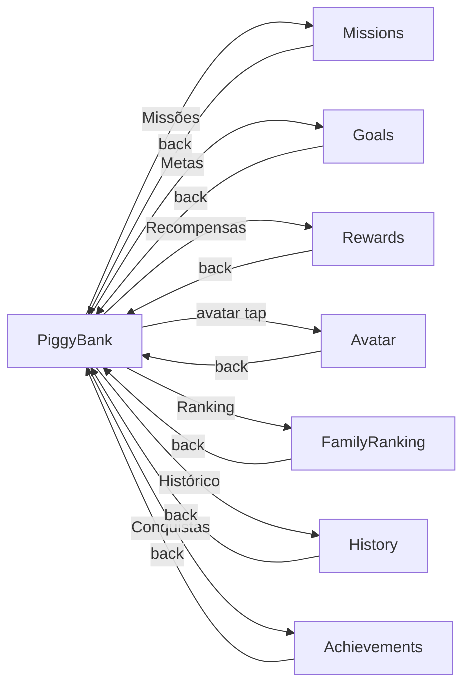
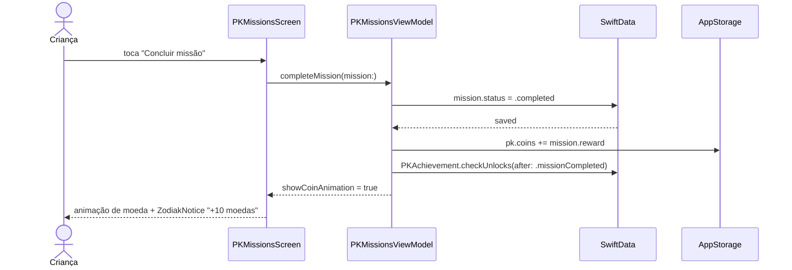

# Épico 34 — PocketBank Kids

> **Categoria**: Projeto Final iOS
> **Prioridade**: P1
> **Plataforma**: iOS (SwiftUI)
> **Status**: Backlog
> **Referência**: [finalBacklog.md — Projeto 6](../../raw_pdf/finalBacklog.md)

---

## Proposta

App de educação financeira gamificado para crianças. A criança acumula moedas virtuais completando missões definidas pela família. Pode definir metas de poupança, resgatar recompensas e subir no ranking familiar. Mecânicas de gamificação: anel de progresso, animação de moeda, confetti e badges.

---

## API e persistência

| Dado | Fonte | Persistência |
|---|---|---|
| Missões | `missions_mock.json` via URLSession + SwiftData `PKMission @Model` | SwiftData |
| Metas de poupança | SwiftData `PKGoal @Model` | SwiftData |
| Recompensas | `rewards_mock.json` via URLSession + SwiftData `PKReward @Model` | SwiftData |
| Conquistas | SwiftData `PKAchievement @Model` | SwiftData |
| Saldo de moedas | `@AppStorage("pk.coins")` | UserDefaults |
| Ranking familiar | `@AppStorage("pk.family_ranking")` (JSON encoded) | UserDefaults |

---

## Diferencial

Gamificação completa: anel circular de progresso (`PKProgressRing` com `Circle` + `trim`), animação de moeda caindo (`.offset` + `withAnimation`), confetti emoji ao resgatar, badges bloqueadas (`.opacity(0.3)` + ícone de cadeado) vs desbloqueadas (coloridas).

---

## Telas (8)

| # | US | Tela | Prioridade |
|---|---|---|---|
| 1 | [US-34.01](us-01-piggy-bank.md) | Cofrinho Principal | P0 |
| 2 | [US-34.02](us-02-goals.md) | Metas de Poupança | P0 |
| 3 | [US-34.03](us-03-missions.md) | Missões | P0 |
| 4 | [US-34.04](us-04-rewards.md) | Recompensas | P0 |
| 5 | [US-34.05](us-05-avatar.md) | Personalizar Avatar | P1 |
| 6 | [US-34.06](us-06-family-ranking.md) | Ranking Familiar | P1 |
| 7 | [US-34.07](us-07-history.md) | Histórico de Moedas | P1 |
| 8 | [US-34.08](us-08-achievements.md) | Conquistas | P1 |

---

## Componentes DS de referência

`ZodiakKeyFigures`, `ZodiakButton`, `ZodiakSecondaryButton`, `ZodiakModal`, `ZodiakNotice`, `ZodiakAlert`, `ZodiakEmptyState`, `ZodiakCardGrid`, `ZodiakStatusChip`, `ZodiakSkeletonLoader`, `ZodiakShowMore`, `ZodiakProgressIndicator`, `ZodiakAvatar`, `ZodiakCheckbox`, `ZodiakTabs`, `ZodiakBadge`, `ZodiakEyebrow`, `ZodiakInfoRow`, `ZodiakDivider`, `ZodiakLabelledField`, `ZodiakLabelledNumericField`, `ZodiakDropdown`

---

## Modelos SwiftData

```swift
@Model class PKMission { var id: UUID; var title: String; var description: String; var reward: Int; var status: PKMissionStatus }
@Model class PKGoal { var id: UUID; var title: String; var emoji: String; var targetAmount: Int; var currentAmount: Int; var createdAt: Date }
@Model class PKReward { var id: UUID; var title: String; var description: String; var cost: Int; var category: String; var isRedeemed: Bool }
@Model class PKAchievement { var id: UUID; var title: String; var description: String; var icon: String; var isUnlocked: Bool; var unlockedAt: Date? }
enum PKMissionStatus: String, Codable { case new, inProgress, completed }
```

---

## Fluxo de navegação



---

## Fluxo de dados — sequência principal (completar missão)


