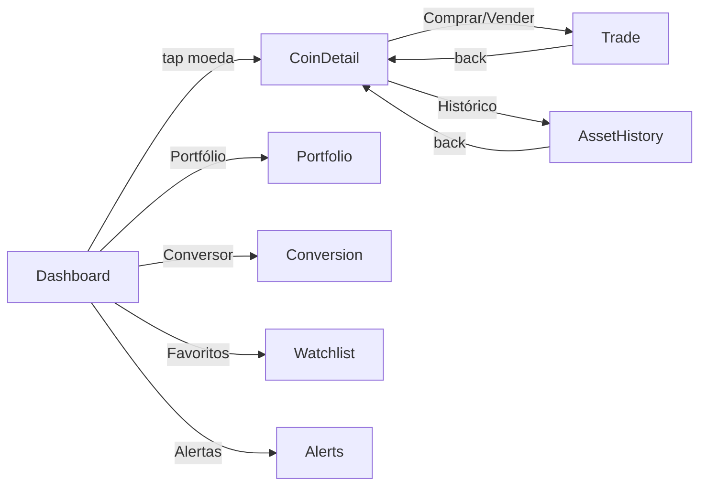

# Épico 35 — Crypto Wallet Fake

> **Categoria**: Projeto Final iOS
> **Prioridade**: P1
> **Plataforma**: iOS (SwiftUI)
> **Status**: Backlog
> **Referência**: [finalBacklog.md — Projeto 7](../../raw_pdf/finalBacklog.md)

---

## Proposta

Carteira de criptomoedas com dados reais da API pública CoinGecko. Exibe cotações ao vivo (refresh automático a cada 5s), mini-gráficos de variação de preço (sparkline), portfólio pessoal com ativos fictícios e sistema de alertas de preço. Sem transações reais — simulação educacional.

---

## API e persistência

| Dado | Fonte | Persistência |
|---|---|---|
| Cotações ao vivo | `https://api.coingecko.com/api/v3/coins/markets?vs_currency=usd&per_page=10` | Nenhuma (in-memory) |
| Fallback offline | `crypto_fallback.json` (bundled) | Nenhuma |
| Histórico de preços | `https://api.coingecko.com/api/v3/coins/{id}/market_chart?vs_currency=usd&days=7` | In-memory |
| Portfólio | SwiftData `CWHolding @Model` | SwiftData |
| Transações fake | SwiftData `CWTransaction @Model` | SwiftData |
| Alertas de preço | SwiftData `CWPriceAlert @Model` | SwiftData |

---

## Diferencial

Dados reais da API pública CoinGecko + `CWSparklineChart` desenhado via `Canvas` SwiftUI + Timer refresh de 5 segundos com indicador visual + sistema de alertas locais (`UserNotifications`).

---

## Telas (8)

| # | US | Tela | Prioridade |
|---|---|---|---|
| 1 | [US-35.01](us-01-dashboard.md) | Dashboard de Mercado | P0 |
| 2 | [US-35.02](us-02-portfolio.md) | Meu Portfólio | P0 |
| 3 | [US-35.03](us-03-coin-detail.md) | Detalhe da Moeda | P0 |
| 4 | [US-35.04](us-04-conversion.md) | Conversor de Moedas | P0 |
| 5 | [US-35.05](us-05-trade.md) | Simular Compra/Venda | P1 |
| 6 | [US-35.06](us-06-watchlist.md) | Lista de Favoritos | P1 |
| 7 | [US-35.07](us-07-alerts.md) | Alertas de Preço | P1 |
| 8 | [US-35.08](us-08-asset-history.md) | Histórico do Ativo | P1 |

---

## Componentes DS de referência

`ZodiakKeyFigures`, `ZodiakButton`, `ZodiakSecondaryButton`, `ZodiakModal`, `ZodiakNotice`, `ZodiakAlert`, `ZodiakEmptyState`, `ZodiakStatusChip`, `ZodiakSkeletonLoader`, `ZodiakShowMore`, `ZodiakProgressIndicator`, `ZodiakAvatar`, `ZodiakTabs`, `ZodiakEyebrow`, `ZodiakInfoRow`, `ZodiakDivider`, `ZodiakLabelledField`, `ZodiakLabelledNumericField`, `ZodiakDropdown`, `ZodiakSearchField`, `ZodiakSwitch`

---

## Modelos SwiftData

```swift
@Model class CWHolding { var id: UUID; var coinId: String; var symbol: String; var name: String; var quantity: Double; var avgBuyPrice: Double; var createdAt: Date }
@Model class CWTransaction { var id: UUID; var coinId: String; var type: CWTransactionType; var quantity: Double; var priceAtTime: Double; var date: Date }
@Model class CWPriceAlert { var id: UUID; var coinId: String; var symbol: String; var targetPrice: Double; var direction: CWAlertDirection; var isTriggered: Bool }
enum CWTransactionType: String, Codable { case buy, sell }
enum CWAlertDirection: String, Codable { case above, below }
```

---

## Fluxo de navegação



---

## Fluxo de dados — sequência principal (refresh cotações)

```mermaid
sequenceDiagram
    participant T as Timer(5s)
    participant VM as CWDashboardViewModel
    participant API as CoinGecko API
    participant FB as crypto_fallback.json

    T->>VM: tick()
    VM->>API: GET /coins/markets
    alt Sucesso
        API-->>VM: [CoinMarket]
        VM-->>VM: coins = decoded; lastUpdated = now
    else Falha de rede
        VM->>FB: load bundled fallback
        FB-->>VM: [CoinMarket]
        VM-->>VM: isFallback = true
    end
    VM-->>Dashboard: @Published coins atualizado
```
