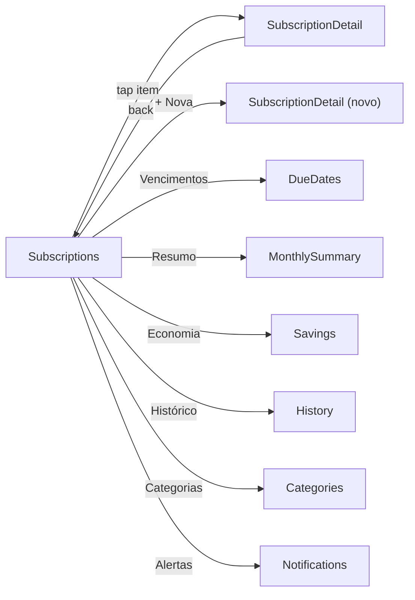
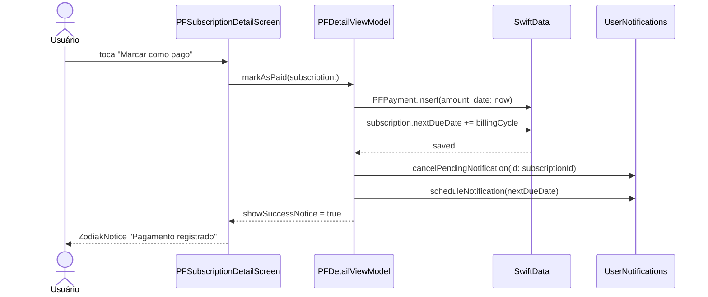

# Épico 36 — PayFlow

> **Categoria**: Projeto Final iOS
> **Prioridade**: P1
> **Plataforma**: iOS (SwiftUI)
> **Status**: Backlog
> **Referência**: [finalBacklog.md — Projeto 8](../../raw_pdf/finalBacklog.md)

---

## Proposta

Gerenciador de assinaturas e gastos recorrentes. O usuário cadastra serviços de assinatura, organiza por categorias, recebe lembretes de vencimento e visualiza relatório mensal de gastos. Heurística de "pouco usado" identifica assinaturas candidatas ao cancelamento. Gráfico de barras dos últimos 6 meses desenhado via `Canvas` SwiftUI.

---

## API e persistência

| Dado | Fonte | Persistência |
|---|---|---|
| Catálogo de serviços | `services_mock.json` via URLSession | Nenhuma (in-memory) |
| Assinaturas do usuário | SwiftData `PFSubscription @Model` | SwiftData |
| Categorias | SwiftData `PFCategory @Model` (seedadas) | SwiftData |
| Pagamentos registrados | SwiftData `PFPayment @Model` | SwiftData |
| Configurações de notificação | `@AppStorage("pf.notify_days_before")` | UserDefaults |

---

## Diferencial

Heurística "pouco usado" (`lastUsedAt < Date.now - 30 dias` → `ZodiakStatusChip` "Pouco usado"), `PFBarChart` de 6 meses via `Canvas` SwiftUI, lembretes via `UserNotifications` no vencimento, exportação de relatório via `ShareLink`.

---

## Telas (8)

| # | US | Tela | Prioridade |
|---|---|---|---|
| 1 | [US-36.01](us-01-subscriptions.md) | Lista de Assinaturas | P0 |
| 2 | [US-36.02](us-02-due-dates.md) | Vencimentos | P0 |
| 3 | [US-36.03](us-03-notifications.md) | Configuração de Alertas | P0 |
| 4 | [US-36.04](us-04-categories.md) | Gerenciar Categorias | P1 |
| 5 | [US-36.05](us-05-history.md) | Histórico de Pagamentos | P1 |
| 6 | [US-36.06](us-06-monthly-summary.md) | Resumo Mensal | P0 |
| 7 | [US-36.07](us-07-savings.md) | Potencial de Economia | P1 |
| 8 | [US-36.08](us-08-subscription-detail.md) | Detalhe da Assinatura | P0 |

---

## Componentes DS de referência

`ZodiakKeyFigures`, `ZodiakButton`, `ZodiakSecondaryButton`, `ZodiakModal`, `ZodiakNotice`, `ZodiakAlert`, `ZodiakWarningButton`, `ZodiakEmptyState`, `ZodiakStatusChip`, `ZodiakSkeletonLoader`, `ZodiakShowMore`, `ZodiakTabs`, `ZodiakBadge`, `ZodiakEyebrow`, `ZodiakInfoRow`, `ZodiakDivider`, `ZodiakLabelledField`, `ZodiakLabelledNumericField`, `ZodiakDropdown`, `ZodiakSwitch`, `ZodiakFormContainer`

---

## Modelos SwiftData

```swift
@Model class PFSubscription {
  var id: UUID; var name: String; var logoName: String
  var amount: Double; var currency: String; var billingCycle: PFBillingCycle
  var nextDueDate: Date; var categoryId: UUID; var lastUsedAt: Date?
  var isActive: Bool; var createdAt: Date
}
@Model class PFCategory { var id: UUID; var name: String; var icon: String; var color: String }
@Model class PFPayment { var id: UUID; var subscriptionId: UUID; var amount: Double; var paidAt: Date }
enum PFBillingCycle: String, Codable { case monthly, quarterly, annual }
```

---

## Fluxo de navegação



---

## Fluxo de dados — sequência principal (registrar pagamento)


