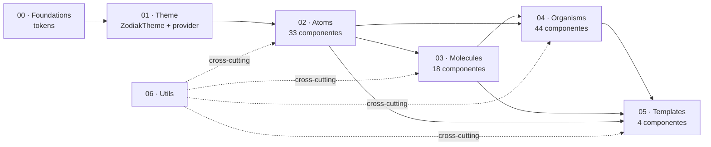
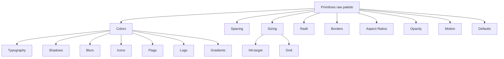
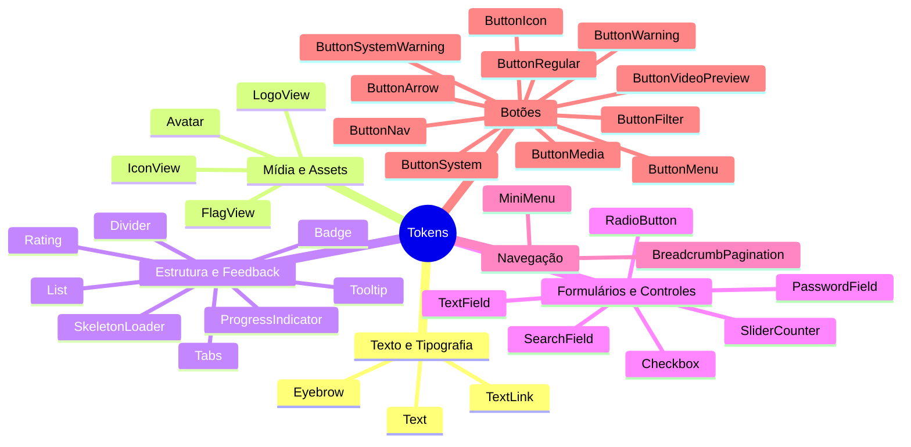
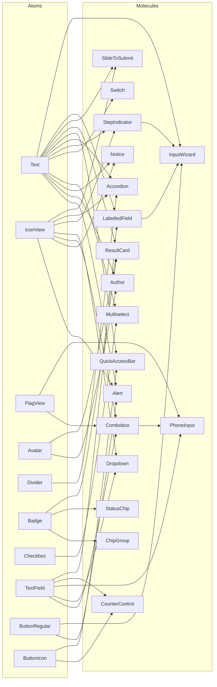
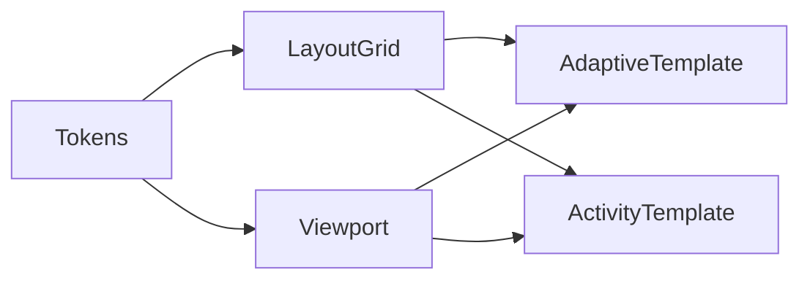
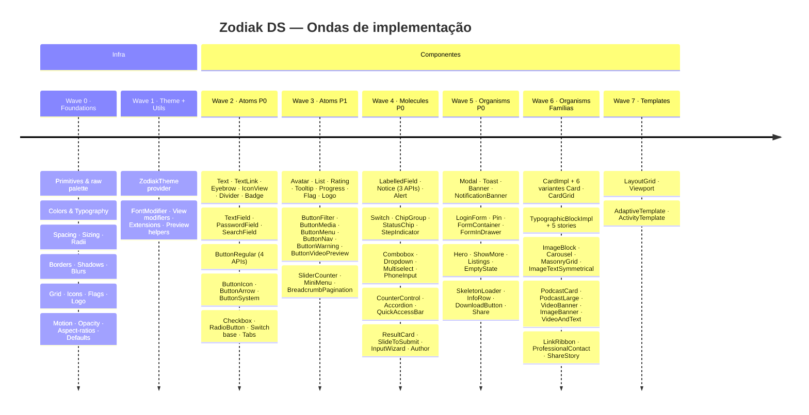
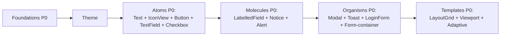

# Dependências & Cronograma — Zodiak DS

Diagramas Mermaid mostrando a ordem de implementação e as dependências entre camadas (foundations → theme → atoms → molecules → organisms → templates) seguindo Atomic Design.

> **Regra**: cada camada só pode consumir camadas inferiores. Composição direta entre componentes da mesma camada é permitida **apenas** dentro de famílias que compartilham um primitivo (`ZodiakCardImpl`, `ZodiakTypographicBlockImpl`).

---

## 1. Visão macro (fases sequenciais)

---

## 2. Foundations — ordem interna

---

## 3. Atoms — dependências (resumo)

Atoms consomem **apenas tokens** (foundations + theme). Sem composição entre atoms.

---

## 4. Molecules — composição

---

## 5. Organisms — composição (chains principais)

```mermaid
flowchart LR
    Text --> Banner
    IconView --> Banner
    ButtonIcon --> Banner

    Text --> Toast
    IconView --> Toast

    Text --> Modal
    ButtonRegular --> Modal
    ButtonIcon --> Modal

    Text --> Hero
    ButtonRegular --> Hero

    TextField --> Pin
    Text --> Pin

    LogoView --> LoginForm
    LabelledField --> LoginForm
    TextField --> LoginForm
    PasswordField --> LoginForm
    ButtonRegular --> LoginForm
    TextLink --> LoginForm

    IconView --> Share
    ButtonIcon --> Share
    Text --> Share

    Notice --> NotificationBanner
    Text --> NotificationBanner
    ButtonIcon --> NotificationBanner

    Text --> Listings
    ResultCard --> Listings
    SkeletonLoader --> Listings
    EmptyState --> Listings

    Text --> EmptyState
    IconView --> EmptyState
    ButtonRegular --> EmptyState

    LabelledField --> FormContainer
    ButtonRegular --> FormContainer

    FormContainer --> FormInDrawer

    Text --> InfoRow
    IconView --> InfoRow

    Text --> ShowMore
    ButtonRegular --> ShowMore

    ButtonRegular --> DownloadButton
    ProgressIndicator --> DownloadButton

    SkeletonLoader

    subgraph cards [Família Cards]
        CardImpl[ZodiakCardImpl primitivo]
        CardHorizontal
        CardTypographic
        CardAuthor
        CardReveal
        CardTall
        CardShortFacts
        CardGrid
    end

    Text --> CardImpl
    IconView --> CardImpl
    Avatar --> CardImpl
    Badge --> CardImpl
    CardImpl --> CardHorizontal
    CardImpl --> CardTypographic
    CardImpl --> CardAuthor
    CardImpl --> CardReveal
    CardImpl --> CardTall
    CardImpl --> CardShortFacts

    CardImpl --> CardGrid

    subgraph typo [Família Tipográfica]
        TypoImpl[ZodiakTypographicBlockImpl primitivo]
        Quote
        TextBlock
        Preamble
        KeyFigures
        HeadlineSection
    end

    Text --> TypoImpl
    TypoImpl --> Quote
    TypoImpl --> TextBlock
    TypoImpl --> Preamble
    TypoImpl --> KeyFigures
    TypoImpl --> HeadlineSection

    subgraph images [Família Imagens]
        ImageBlock
        Carousel
        MasonryGrid
        ImageTextSymmetrical
        VideoBanner
        ImageBanner
        VideoAndText
    end

    IconView --> ImageBlock
    Text --> ImageBlock
    ImageBlock --> Carousel
    ImageBlock --> MasonryGrid
    ImageBlock --> ImageTextSymmetrical

    Text --> LinkRibbon
    IconView --> LinkRibbon
    Avatar --> ProfessionalContact
    Text --> ProfessionalContact
    ButtonIcon --> ProfessionalContact
    ButtonRegular --> ShareStory

    subgraph podcast [Família Podcast]
        PodcastCard
        PodcastLarge
    end

    ImageBlock --> PodcastCard
    Text --> PodcastCard
    ButtonIcon --> PodcastCard
    PodcastCard --> PodcastLarge

    ImageBlock --> VideoBanner
    ButtonVideoPreview --> VideoBanner

    ImageBlock --> ImageBanner

    ImageBlock --> VideoAndText
    Text --> VideoAndText
```

---

## 6. Templates

---

## 7. Cronograma (Gantt — ondas de implementação)

---

## 8. Caminho crítico (P0 mínimo para destravar app)

---

## 9. Notas de leitura

- Setas indicam **dependência de composição** (A → B significa B consome A).
- Linhas tracejadas em §1 indicam dependência cross-cutting (utils são usados em todas as camadas mas não compõem outros componentes).
- Primitivos internos (`ZodiakCardImpl`, `ZodiakTypographicBlockImpl`, `ZodiakButtonImpl`, etc.) aparecem em §5 dentro de subgrafos das respectivas famílias.
- Agrupamentos visuais: §3 usa **mindmap** por categorias; §4 e §5 usam **subgraphs** para separar camadas; §7 usa **timeline** para as ondas de entrega.

Para detalhe por componente, ver cada história em [02-atoms/](02-atoms/), [03-molecules/](03-molecules/), [04-organisms/](04-organisms/), [05-templates/](05-templates/), [06-utils/](06-utils/).
